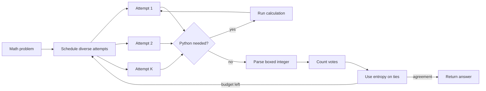

# AIMO3 Agentic Inference

<p align="center">
  
</p>

<p align="center">
  <a href="https://github.com/xufenghe/aimo3-agentic-inference/actions/workflows/tests.yml"></a>
  <a href="https://www.python.org/"></a>
  <a href="LICENSE"></a>
  <a href="https://github.com/xufenghe/aimo3-agentic-inference/releases/tag/v0.2.0"></a>
</p>

<p align="center">
  <a href="https://xufenghe.github.io/aimo3-agentic-inference/">Project site</a> ·
  <a href="docs/quickstart.md">Quickstart</a> ·
  <a href="docs/architecture.md">Architecture</a> ·
  <a href="docs/benchmarking.md">Benchmarking</a> ·
  <a href="docs/replay.md">Replay ablations</a>
</p>

An open-source, AIMO3-style math reasoning agent for vLLM and other OpenAI-compatible model servers. It runs several independent solutions, gives each one a Python tool for checking calculations, and stops when enough attempts agree on the same boxed integer.

I built this because the useful part of an olympiad-math system is not one long notebook. It is the loop around the model: sampling, tool use, deadlines, answer parsing, voting, and failure handling. This repository keeps that loop small enough to read and test.

> This is an independent clean-room project inspired by the AI Mathematical Olympiad ecosystem. It is not an official AIMO or Kaggle repository, and it does not include competition data or model weights.

## What it does

- Sends parallel reasoning attempts to a vLLM or OpenAI-compatible Chat Completions endpoint.
- Rotates through four solution styles instead of repeating the same prompt eight times.
- Handles structured Python tool calls in a separate process with time and output limits.
- Accepts only a valid final `\boxed{integer}` before an answer can enter the vote.
- Uses vote count first, then token entropy to break close calls consistently.
- Stops early on agreement and enforces one total deadline across all attempts.
- Evaluates JSONL problem sets without writing problem text or chain-of-thought to the run log.

The Python package has no third-party runtime dependencies.

## Try the loop without a GPU

```bash
git clone https://github.com/xufenghe/aimo3-agentic-inference.git
cd aimo3-agentic-inference
python -m venv .venv
source .venv/bin/activate
python -m pip install -e .
aimo3 demo
```

The demo uses fake model attempts, so it only checks the control flow. It should stop after four votes for `42`.

## Run it with vLLM and gpt-oss

With vLLM already installed in a GPU environment:

```bash
vllm serve openai/gpt-oss-20b \
  --enable-auto-tool-choice \
  --tool-call-parser openai \
  --api-key local-token
```

In another shell:

```bash
export AIMO_API_KEY=local-token

aimo3 doctor \
  --base-url http://127.0.0.1:8000/v1 \
  --model openai/gpt-oss-20b

aimo3 solve \
  --base-url http://127.0.0.1:8000/v1 \
  --model openai/gpt-oss-20b \
  "What is the remainder when 2^20 is divided by 17?"
```

Tool-call flags differ across vLLM and model versions. The [vLLM notes](docs/vllm.md) cover the compatibility switches used by this client.

## Evaluate a problem set

The evaluator reads one JSON object per line. `answer` is optional.

```json
{"id":"demo-1","problem":"What is 19 + 23?","answer":42}
```

```bash
aimo3 evaluate examples/problems.jsonl \
  --base-url http://127.0.0.1:8000/v1 \
  --model openai/gpt-oss-20b \
  --attempts 8 \
  --early-stop 4 \
  --output outputs/results.jsonl
```

The command will not replace an existing result file unless you pass `--overwrite`. Results are published only after the full evaluation succeeds; a failed run leaves an existing result file intact. See [benchmarking](docs/benchmarking.md) before comparing two configurations.

To compare vote-only and inverse-entropy selection without another model run, use `aimo3 replay` with saved attempt metadata. The [replay guide](docs/replay.md) documents the privacy-conscious fixture schema.

## The inference loop



Raw vote count always wins over the entropy score. Entropy only helps rank answers with the same support. The deadline uses `time.monotonic()`, and stalled HTTP calls are clipped to the time left for the whole solve.

## Repository map

| Path | What is there |
|---|---|
| `runner.py` | Chat and Python-tool loop for one reasoning attempt |
| `backends/openai_compatible.py` | Small Chat Completions client for vLLM-style endpoints |
| `tools/python_subprocess.py` | Local Python runner with an AST policy and resource limits |
| `orchestrator.py` | Parallel attempts, deadline handling, cancellation, and early stop |
| `consensus.py` | Vote and entropy-based answer ranking |
| `dataset.py` / `telemetry.py` | JSONL input, scoring, and compact run logs |
| `tests/` | Deterministic tests that do not need a model or GPU |

The [architecture note](docs/architecture.md) describes the interfaces used to swap a backend, tool runner, or selection policy.

## Python API

```python
import time

from aimo3_inference import (
    InferenceOrchestrator,
    MathRunnerConfig,
    SolverConfig,
    ToolAugmentedMathRunner,
)
from aimo3_inference.backends import OpenAICompatibleBackend
from aimo3_inference.tools import LocalPythonTool

backend = OpenAICompatibleBackend(
    "http://127.0.0.1:8000/v1",
    api_key="local-token",
)
runner = ToolAugmentedMathRunner(
    problem="What is the remainder when 2^20 is divided by 17?",
    backend=backend,
    config=MathRunnerConfig(model="openai/gpt-oss-20b"),
    python_tool=LocalPythonTool(timeout=8),
)
solver = InferenceOrchestrator(SolverConfig(attempts=8, early_stop=4))
outcome = solver.solve(runner, deadline=time.monotonic() + 300)
print(outcome.answer, outcome.stop_reason, outcome.candidates)
```

## Current limits

- `LocalPythonTool` is a local guardrail, not a security sandbox. Use a container or microVM for untrusted code.
- Only non-negative integer answers are supported by the built-in parser.
- The repository does not publish a benchmark score yet.
- Training, model weights, Kaggle submission code, and private test material are out of scope.

Read [SECURITY.md](SECURITY.md) before exposing a model or tool endpoint to other users.

## Common questions

**Does this require gpt-oss?** No. `gpt-oss-20b` is the documented example; any compatible chat model can be selected with `--model`.

**Is this a self-consistency implementation?** Yes, with two additions: attempts can call Python, and equal-vote answers are ranked with token entropy.

**Can it run without a GPU?** The package, tests, and mock demo can. Real inference needs a reachable model server, which may be local or remote.

**Is the original AIMO notebook included?** No. This repository contains a clean-room implementation of the reusable inference components. [NOTICE.md](NOTICE.md) records the provenance boundary.

## Contributing

Issues with a small reproduction are especially useful. If you want to add a backend, sandbox, or voting policy, read [CONTRIBUTING.md](CONTRIBUTING.md) and include a deterministic test.

The code is available under the MIT License. Models, datasets, competition APIs, and referenced projects keep their own terms.
