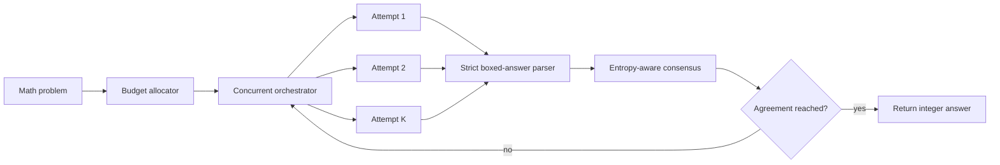

# AIMO3 Agentic Inference

[](https://www.python.org/)
[](#quick-start)
[](LICENSE)

A small, hardware-agnostic toolkit for building tool-augmented mathematical reasoning systems. It isolates the reusable parts of an AIMO-style inference stack: parallel attempts, strict answer parsing, uncertainty-aware consensus, early stopping, and deadline-aware compute allocation.

The core package has no third-party runtime dependencies. Model serving and Python-tool execution are injected behind a callable interface, so the same orchestration code can sit above vLLM, an OpenAI-compatible endpoint, or a local test double.

## Why this repository exists

Olympiad-style answer generation is not only a prompting problem. Under a fixed compute budget, a practical solver must also decide:

- how many independent reasoning paths to explore;
- when agreement is strong enough to stop early;
- how to compare answers with different uncertainty levels;
- how much time can be spent on the current problem without starving later problems;
- how to reject malformed outputs before they enter a vote.

This repository makes those decisions explicit, testable, and independent from a 120B model runtime.

## Architecture



## Included components

| Component | Responsibility |
|---|---|
| `answers.py` | Parse the last valid `\\boxed{...}` integer in the allowed range |
| `entropy.py` | Compute Shannon entropy from top-token log probabilities |
| `consensus.py` | Aggregate votes with inverse-entropy confidence and deterministic tie-breaking |
| `budget.py` | Reserve time for future problems while bounding the current deadline |
| `orchestrator.py` | Run attempts concurrently and stop once consensus is stable |
| `examples/mock_demo.py` | Run the full control flow without a GPU or model download |

## Quick start

```bash
python -m unittest discover -s tests -v
PYTHONPATH=src python examples/mock_demo.py
```

Expected demo output:

```text
answer=42
attempts_completed=5
stopped_early=True
```

## Integrating a model backend

Implement one callable that receives an attempt index and an absolute deadline, then returns an `AttemptResult`:

```python
from aimo3_inference import AttemptContext, AttemptResult, InferenceOrchestrator, SolverConfig


def run_model_attempt(context: AttemptContext) -> AttemptResult:
    if context.stop_event.is_set():
        return AttemptResult(attempt_id=context.attempt_id, answer=None)
    # 1. Generate a reasoning trajectory with your model server.
    # 2. Execute tool calls in an isolated Python worker if requested.
    # 3. Parse the final answer and collect token log probabilities.
    return AttemptResult(
        attempt_id=context.attempt_id,
        answer=42,
        mean_entropy=0.31,
        python_calls=2,
        python_errors=0,
    )


solver = InferenceOrchestrator(SolverConfig(attempts=8, early_stop=4))
outcome = solver.solve(run_model_attempt, deadline=10_000_000_000.0)
print(outcome.answer)
```

The `stop_event` enables cooperative cancellation after consensus or deadline expiry. The orchestration layer intentionally does not execute arbitrary model-generated code. A production adapter should place tool execution in a restricted process or container with explicit CPU, memory, filesystem, and wall-clock limits.

## Design choices

- **Strict parsing:** only non-negative integers inside `\\boxed{}` are accepted.
- **Uncertainty-aware voting:** repeated answers accumulate inverse-entropy weight; raw vote count remains the first-order signal.
- **Deterministic ties:** ties are resolved by vote count, confidence weight, lower median entropy, then numeric answer.
- **Bounded concurrency:** a fixed worker pool prevents runaway attempt creation.
- **Backend separation:** the core is testable on a laptop even when the intended competition runtime requires an H100-class GPU.

## Project status

This release is the reusable inference-control core. It does not bundle model weights, Kaggle competition data, offline wheel archives, or a third-party submission notebook.

See [NOTICE.md](NOTICE.md) for provenance and reuse boundaries.

## License

The clean-room implementation in this repository is released under the MIT License. Third-party models, datasets, competition APIs, and upstream notebooks retain their own terms.
