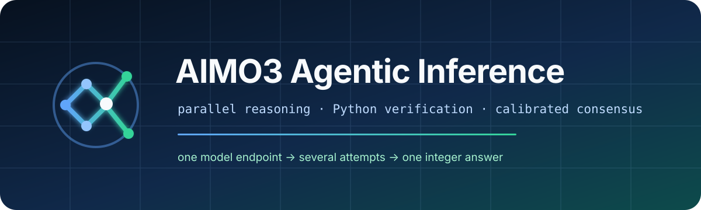
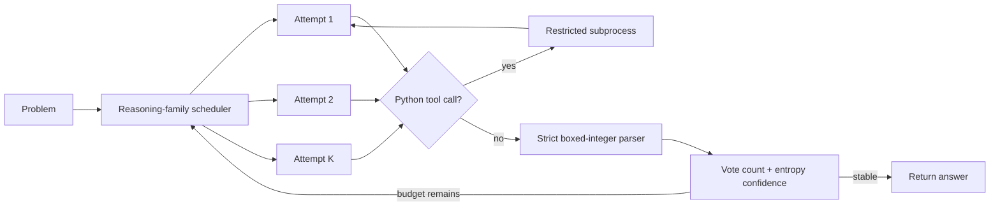

<p align="center">
  
</p>

<p align="center">
  <a href="https://github.com/xufenghe/aimo3-agentic-inference/actions/workflows/tests.yml"></a>
  <a href="https://www.python.org/"></a>
  <a href="LICENSE"></a>
  <a href="https://github.com/xufenghe/aimo3-agentic-inference/issues"></a>
</p>

<p align="center">
  A small, inspectable inference system for tool-augmented mathematical reasoning.<br>
  OpenAI-compatible backends · parallel attempts · bounded Python execution · uncertainty-aware consensus
</p>

---

`aimo3-agentic-inference` turns one model endpoint into a deadline-aware math-solving system. It launches diverse reasoning attempts, lets the model verify calculations through a structured Python tool, rejects malformed final answers, and stops when independent attempts reach stable agreement.

The orchestration package has **zero third-party runtime dependencies**. It works with vLLM and other Chat Completions-compatible servers; model weights and competition data are deliberately not bundled.

## Why use it?

- **Run something immediately.** The mock demo exercises concurrency and early stopping without a GPU.
- **Connect a real model with one URL.** A dependency-free HTTP client handles chat, tool calls, logprobs, timeouts, and API-key headers.
- **Keep failures bounded.** Overall deadlines, request timeouts, tool timeouts, output caps, cancellation, and strict answer parsing are explicit.
- **Measure the system.** The JSONL evaluator reports exact-match accuracy and writes compact, prompt-free run records.
- **Change one idea at a time.** Backends, attempt runners, budget allocation, and consensus are separate typed components.

## 60-second start

```bash
git clone https://github.com/xufenghe/aimo3-agentic-inference.git
cd aimo3-agentic-inference
python -m venv .venv
source .venv/bin/activate
python -m pip install -e .
aimo3 demo
```

The demo needs no model and should return answer `42` after early consensus.

## Connect a model server

Start an OpenAI-compatible server. For example, a current vLLM installation can serve an open-weight model with automatic tool selection:

```bash
vllm serve openai/gpt-oss-20b \
  --enable-auto-tool-choice \
  --tool-call-parser openai \
  --api-key local-token
```

Then check the connection and solve a problem:

```bash
export AIMO_API_KEY=local-token

aimo3 doctor \
  --base-url http://127.0.0.1:8000/v1 \
  --model openai/gpt-oss-20b

aimo3 solve \
  --base-url http://127.0.0.1:8000/v1 \
  --model openai/gpt-oss-20b \
  "What is the remainder when 2^20 is divided by 17?"
```

Backend flags vary by model and vLLM version. See the [vLLM setup guide](docs/vllm.md) before a GPU run.

## Evaluate a JSONL set

Each line needs `id` and `problem`; `answer` is optional and must be an integer.

```json
{"id":"demo-1","problem":"What is 19 + 23?","answer":42}
```

```bash
aimo3 evaluate examples/problems.jsonl \
  --base-url http://127.0.0.1:8000/v1 \
  --model openai/gpt-oss-20b \
  --attempts 8 \
  --early-stop 4 \
  --output outputs/results.jsonl
```

Re-running against an existing output is refused unless `--overwrite` is supplied. Run records contain predictions and aggregate metrics, not problem text or chain-of-thought. See [benchmarking](docs/benchmarking.md) for a reproducible comparison protocol.

## How it works



The selector treats vote count as the primary signal, then uses inverse entropy and deterministic tie-breaks. It never accepts an unboxed number by accident. The orchestrator uses a monotonic absolute deadline, so stalled attempts cannot silently consume the whole evaluation budget.

| Module | Responsibility |
|---|---|
| `runner.py` | Multi-round chat/tool loop and reasoning-path diversity |
| `backends/openai_compatible.py` | Chat Completions HTTP transport and response validation |
| `tools/python_subprocess.py` | AST policy, isolated interpreter, resource and output limits |
| `orchestrator.py` | Bounded concurrency, cooperative cancellation, hard deadline |
| `consensus.py` | Deterministic uncertainty-aware candidate ranking |
| `dataset.py` / `telemetry.py` | JSONL evaluation and privacy-conscious run records |

Read the [architecture walkthrough](docs/architecture.md) for extension points and invariants.

## Python API

```python
import time

from aimo3_inference import (
    InferenceOrchestrator,
    MathRunnerConfig,
    SolverConfig,
    ToolAugmentedMathRunner,
)
from aimo3_inference.backends import OpenAICompatibleBackend
from aimo3_inference.tools import LocalPythonTool

backend = OpenAICompatibleBackend(
    "http://127.0.0.1:8000/v1",
    api_key="local-token",
)
runner = ToolAugmentedMathRunner(
    problem="What is the remainder when 2^20 is divided by 17?",
    backend=backend,
    config=MathRunnerConfig(model="openai/gpt-oss-20b"),
    python_tool=LocalPythonTool(timeout=8),
)
solver = InferenceOrchestrator(SolverConfig(attempts=8, early_stop=4))
outcome = solver.solve(runner, deadline=time.monotonic() + 300)
print(outcome.answer, outcome.stop_reason, outcome.candidates)
```

## Safety boundary

`LocalPythonTool` is a best-effort guard against accidental unsafe code, **not a hardened sandbox**. Its AST filter, isolated interpreter, temporary working directory, and resource limits do not make hostile code safe. Use a locked-down container, microVM, or remote sandbox for untrusted models or multi-user services. Read [SECURITY.md](SECURITY.md) before enabling tools outside a local experiment.

## Project scope

The repository currently provides an inference and evaluation core. It does not include:

- model weights or a model-training pipeline;
- Kaggle datasets, private test problems, or submission credentials;
- claimed competition placement or benchmark scores;
- the upstream notebook discussed in [NOTICE.md](NOTICE.md).

The next useful milestones are tracked through [GitHub issues](https://github.com/xufenghe/aimo3-agentic-inference/issues). Small, test-backed contributions are welcome; start with [CONTRIBUTING.md](CONTRIBUTING.md).

## License and provenance

The clean-room code in this repository is MIT licensed. Models, datasets, competition APIs, and referenced projects keep their own licenses and terms. See [NOTICE.md](NOTICE.md) for the provenance boundary.
